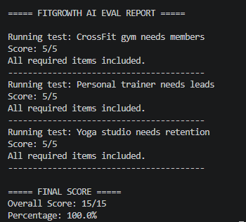
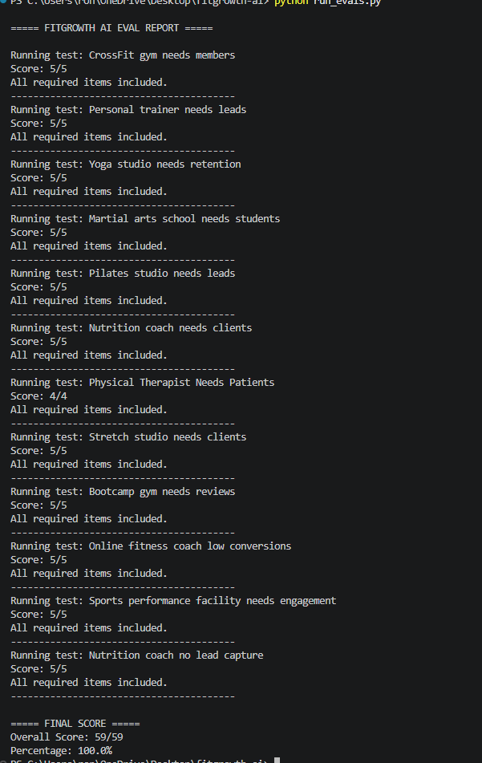

# FitGrowth AI

FitGrowth AI is an AI-powered marketing consultant for fitness businesses such as CrossFit gyms, personal trainers, and yoga studios.

The project demonstrates core prompt engineering skills used in production AI systems:

* System Prompt Design
* Retrieval-Augmented Generation (RAG)
* Structured Prompting
* Automated Evaluations (Evals)

FitGrowth AI uses a custom system prompt, a file-based marketing knowledge base, and an automated evaluation framework to generate and test business growth recommendations for fitness businesses.

## Problem

Fitness business owners often receive generic marketing advice that is not tailored to their business, location, budget, or growth goals.

FitGrowth AI generates customized marketing recommendations using a structured business intake process and a curated fitness marketing knowledge base.

## Features

### Structured Business Analysis

Users provide:

* Business Type
* Location
* Current Member Count
* Marketing Budget
* Growth Challenge

The assistant generates:

* Missing Information
* Quick Diagnosis
* Best Growth Opportunities
* 7-Day Action Plan
* Suggested Offer
* Success Metrics

### Retrieval-Augmented Generation (RAG)

FitGrowth AI retrieves information from a custom knowledge base before generating recommendations.

Current knowledge sources include:

* Referral Marketing
* Local SEO
* Facebook Ads
* Lead Magnets
* Gym Retention

This helps ensure recommendations are grounded in business-specific marketing knowledge rather than relying entirely on model training data.

### Automated Evaluations

The project includes an evaluation framework that tests the assistant across multiple business scenarios.

Example evaluation criteria:

* Mentions referral strategies
* Includes local SEO recommendations
* References lead generation tactics
* Includes retention strategies
* Recommends appropriate follow-up processes

Evaluation results are automatically scored.

## Example Eval Results

Current evaluation score:

15 / 15

100% Pass Rate

Test Scenarios:

* CrossFit Gym seeking memberships
* Personal Trainer seeking leads
* Yoga Studio improving retention

## Technical Stack

* Python
* OpenAI API
* GPT-5
* dotenv
* File-based knowledge retrieval
* Custom evaluation framework

## Project Structure

fitgrowth-ai/

* prompts/

  * system_prompt.txt

* knowledge/

  * referral_marketing.txt
  * local_seo.txt
  * facebook_ads.txt
  * lead_magnets.txt
  * gym_retention.txt

* evals/

  * test_cases.txt

* test_openai.py

* run_evals.py

## Key Learning Outcomes

This project demonstrates:

1. Designing and iterating on system prompts
2. Building a Retrieval-Augmented Generation workflow
3. Creating automated evaluation pipelines
4. Measuring and improving model performance through testing

## Future Improvements

* Vector database retrieval
* Semantic search
* Web application interface
* WordPress integration
* LLM-as-a-Judge evaluations
* Additional fitness marketing knowledge sources

## Evaluation Results

Current automated evaluation score:

**15/15 (100%)**

## Evaluation Results Extended

The project includes an automated evaluation framework that tests recommendations across multiple fitness business scenarios.

Current Results:

- 12 business scenarios tested
- 59 evaluation checks
- 100% passing score

